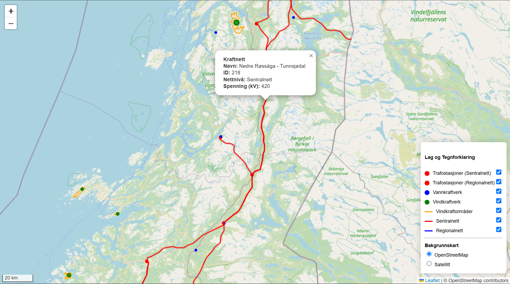

# Gruppe 14 IS218 oppgave 5

Programmet svarer på problemstillingen "Hvordan kan et interaktivt kart over Norges strøm- og energiforsyning bidra til økt beredskap og samfunnssikkerhet ved strømbrudd og energikrise, samt hjelpe myndigheter med å forutsi og håndtere sårbare områder mer effektivt?"
Applikasjonen retter fokuset på beredskapen rundt energiforsyningen i Norge. Den geopolitiske situasjonen og en stadig mer usikker verdensutvikling gjør det nødvendig å vurdere energiforsyningen som et sårbart og utsatt mål. Klimaendringer og naturkatastrofer er også en stadig økende trussel mot strømmenettet og øvrig infrastruktur knyttet til energi.

Dette prosjektet er en enkel frontend-applikasjon som består av tre filer: index.html, main.js og styles.css. For å bruke applikasjonen lastet filene ned eller klones fra github og kjøres fra filen index.html. Applikasjonen kjøres direkte i nettleseren og krever ingen server eller byggverktøy, og viser sentral- og regionalnettet, vind- og vannkraftverk og transformatorer på sentral- og regionalnettet. 

Egne funksjoner for brukerstyrt filtrering på kartlagene er lagt til for å hjelpe brukerene med å få et oversiktlig bilde av infrastrukturen de selv ønsker å se på, og popups koblet til hvert punkt gir brukeren relevant info som navn, spenning, strekning eller lignende (se Figur 1).

Figur 1: Viser popup koblet til en kratledning på sentralkraftnettet

Videoene under viser oppstart av applikasjonen, infobokser til markeringene, endring av bakgrunnskart og filtrering av datasett 

